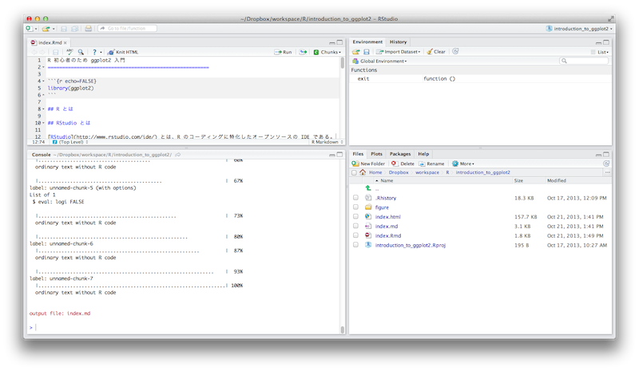
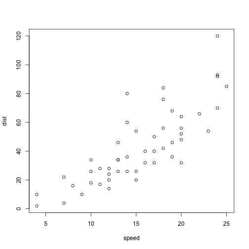
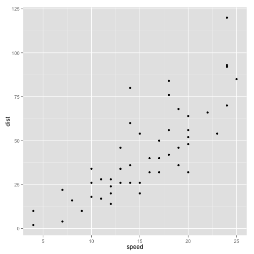
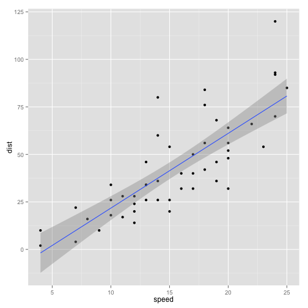

R 初心者のため ggplot2 入門
========================================================

## R 言語とは

R 言語とは統計解析、機械学習、データマイニングのプログラミング言語で、多変量解析やデータの可視化などをかんたんに実行することができる。

## RStudio とは

[RStudio](http://www.rstudio.com/ide/) とは、R のコーディングに特化したオープンソースの IDE である。

## ggplot2 とは

[ggplot2](http://ggplot2.org) とはグラフィクスパッケージのひとつで『[The Grammar of Graphics](http://www.springer.com/statistics/computational+statistics/book/978-0-387-24544-7)』という本にまとめられた統計画像表示の概念をベースに開発されている。デフォルトの作図コマンドよりも効率的に作図ができ、しかも分かりやすくて美しい図を描くことができる。

ggplot2 のコンセプトについては [Rのグラフィック作成パッケージ“ggplot2”について | Colorless Green Ides](http://f-n.daa.jp/2011/10/22/ggplot2/) を参照。

### デフォルトの作図コマンド

<pre class="knitr r">plot(cars)
</pre>

### ggplot2

<pre class="knitr r">ggplot(cars, aes(speed, dist)) + geom_point()
</pre>

簡単に回帰直線を描くこともできる。

<pre class="knitr r">ggplot(cars, aes(speed, dist)) + geom_point() + geom_smooth(method="lm")
</pre>

## ggplot2 の使い方

Tokyo.R での発表資料を参照。

<iframe src="http://www.slideshare.net/slideshow/embed_code/4618953" width="597" height="486" frameborder="0" marginwidth="0" marginheight="0" scrolling="no" style="border:1px solid #CCC;border-width:1px 1px 0;margin-bottom:5px" allowfullscreen> </iframe> 
 <strong> <a href="https://www.slideshare.net/dichika/ggplot2" title="ggplot2できれいなグラフ" target="_blank">ggplot2できれいなグラフ</a> </strong> from <strong><a href="http://www.slideshare.net/dichika" target="_blank">dichika</a></strong> 

<iframe src="http://www.slideshare.net/slideshow/embed_code/6739947" width="597" height="486" frameborder="0" marginwidth="0" marginheight="0" scrolling="no" style="border:1px solid #CCC;border-width:1px 1px 0;margin-bottom:5px" allowfullscreen> </iframe> 
 <strong> <a href="https://www.slideshare.net/aad34210/ggplot2-110129" title="ggplot2 110129" target="_blank">ggplot2 110129</a> </strong> from <strong><a href="http://www.slideshare.net/aad34210" target="_blank">Takashi Minoda</a></strong> 

<iframe src="http://www.slideshare.net/slideshow/embed_code/14866373" width="597" height="486" frameborder="0" marginwidth="0" marginheight="0" scrolling="no" style="border:1px solid #CCC;border-width:1px 1px 0;margin-bottom:5px" allowfullscreen> </iframe> 
 <strong> <a href="https://www.slideshare.net/holidayworking/ggplot2-14866373" title="ggplot2 に入門してみた" target="_blank">ggplot2 に入門してみた</a> </strong> from <strong><a href="http://www.slideshare.net/holidayworking" target="_blank">Hidekazu Tanaka</a></strong> 

